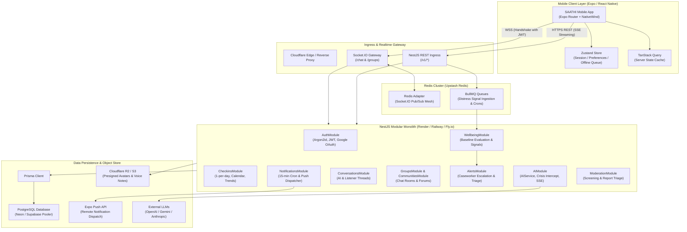
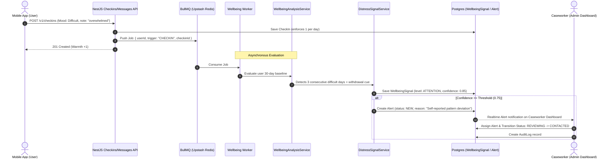

# SAATHI — System Architecture & Engineering Blueprint

> **Stack:** Expo SDK (React Native) + NestJS + PostgreSQL (Prisma) + Upstash Redis (Socket.IO + BullMQ) + Cloudflare R2 / S3  
> **Hosting Strategy:** 100% Cloud-Hosted (Zero Local Infrastructure)

---

## 1. High-Level System Architecture

The following diagram illustrates the cloud topology and service interaction model:



---

## 2. Monorepo Organization

The project is structured as an enterprise monorepo using **npm workspaces** or **pnpm workspaces**:

```text
saathi/
├── apps/
│   ├── mobile/             # Expo React Native client application
│   │   ├── app/            # Expo Router file routes
│   │   ├── src/            # Reusable UI components, hooks, stores, theme
│   │   ├── tailwind.config.js # NativeWind token definitions
│   │   └── package.json
│   └── api/                # NestJS backend application
│       ├── src/            # Modular domain services, guards, filters
│       ├── prisma/         # Prisma schema and seed scripts
│       └── package.json
├── packages/
│   └── shared/             # Shared TypeScript types, Zod schemas, constants
│       ├── src/
│       │   ├── enums.ts    # Enums (Role, Mood, SignalLevel, AlertStatus, etc.)
│       │   ├── types.ts    # Request/Response shapes, DTO interfaces
│       │   └── schemas/    # Zod validation schemas
│       └── package.json
└── docs/                   # Full handover and architectural documentation
```

---

## 3. NestJS Backend Architecture

### 3.1 Modular Monolith Domains

The backend is separated into strict functional domains within `apps/api/src/modules/`:

1. **`AuthModule`**:
   - Handles password hashing via Argon2id (`@node-rs/argon2`).
   - Issues 15-minute access JWTs and 30-day rotating refresh tokens.
   - Verifies Google OAuth ID tokens via `google-auth-library`.
2. **`CheckinsModule`**:
   - Enforces unique check-ins per user per local date (`localDate: "YYYY-MM-DD"`).
   - Calculates monthly calendar matrices, streak ("warmth") counts, and cubic Bézier trend coordinates.
3. **`AIModule`**:
   - Encapsulates `AIService` with swappable implementations (`OpenAIProvider`, `GeminiProvider`, `MockProvider`).
   - Streams responses via Server-Sent Events (`Observable<MessageEvent>`).
   - Applies pre-generation crisis interceptor and post-generation diagnostic terminology sanitizer.
4. **`WellbeingModule` & `AlertsModule`**:
   - Processes asynchronous user signals via BullMQ worker.
   - Computes deviation from individual user 30-day baselines.
   - Escalates high-confidence distress cues to the `Alert` table for caseworker review.
5. **`RealtimeModule` (Socket.IO Gateway)**:
   - Houses `/chat` and `/groups` WebSocket gateways.
   - Backed by `@socket.io/redis-adapter` connected to Upstash Redis.
   - Verifies JWT in handshake before allowing connection.

### 3.2 Uniform Response Envelope & Filters

All REST endpoints implement a consistent JSON envelope:

```typescript
export interface ApiResponse<T> {
  data: T | null;
  error: {
    code: string;
    message: string;
    details?: unknown;
  } | null;
}
```

Implemented via a global NestJS `TransformInterceptor`:
```typescript
@Injectable()
export class TransformInterceptor<T> implements NestInterceptor<T, ApiResponse<T>> {
  intercept(context: ExecutionContext, next: CallHandler): Observable<ApiResponse<T>> {
    return next.handle().pipe(map(data => ({ data, error: null })));
  }
}
```

And a global `GlobalHttpExceptionFilter`:
```typescript
@Catch()
export class GlobalHttpExceptionFilter implements ExceptionFilter {
  catch(exception: unknown, host: HttpArgumentsHost) {
    const ctx = host.switchToHttp();
    const response = ctx.getResponse<Response>();
    const status = exception instanceof HttpException ? exception.getStatus() : HttpStatus.INTERNAL_SERVER_ERROR;
    const message = exception instanceof HttpException ? exception.message : "Internal server error";

    response.status(status).json({
      data: null,
      error: {
        code: `ERR_${status}`,
        message,
      },
    });
  }
}
```

---

## 4. Mobile Architecture (Expo & React Native)

### 4.1 Navigation Structure (Expo Router)

The navigation tree uses Expo Router v3 file-based routing:

```text
app/
├── _layout.tsx              # Root: ThemeProvider, TanStack QueryClientProvider, AuthProvider
├── (auth)/
│   ├── _layout.tsx
│   ├── login.tsx            # Email/Password + Google Sign-In button
│   └── register.tsx         # Account creation + Informed consent modal
├── (tabs)/
│   ├── _layout.tsx          # Custom tab bar with soft haptics & badges
│   ├── home.tsx             # Mascot companion, daily check-in card, warmth streak, quick feed
│   ├── talk.tsx             # Segmented control: SAATHI AI Chat, Listeners, Group Channels
│   ├── community.tsx        # Community post feeds, categories, post creation modal
│   ├── support.tsx          # Human listeners, counsellors, emergency crisis resource card
│   └── profile.tsx          # Journey milestone path, collectible badge showcase, calendar modal
└── modals/
    ├── checkin-modal.tsx    # Daily check-in sheet (Good, Calm, Okay, Tired, Low, Difficult)
    ├── calendar-modal.tsx   # Check-in history calendar & trend curve
    └── listener-request.tsx # 1:1 Listener booking modal
```

### 4.2 State Management Strategy

1. **Server State (TanStack Query v5):**
   - Manages all remote API requests, caching, query invalidation, and optimistic updates.
   - Example query keys: `['checkins', 'calendar', month]`, `['badges', 'me']`, `['groups', id, 'messages']`.
2. **Client State (Zustand):**
   - **`useAuthStore`**: Stores active access JWT and current user profile metadata.
   - **`usePreferencesStore`**: Stores theme, reduced-motion setting, reminder times, and notification toggles.
   - **`useOfflineQueueStore`**: Caches pending check-ins or messages when network is lost, syncing automatically upon reconnection.

---

## 5. Distress Monitoring & Risk Escalation Pipeline



---

## 6. Realtime Communication Architecture

### 6.1 Redis Pub/Sub Adapter Setup
NestJS connects Socket.IO to Upstash Redis:

```typescript
// apps/api/src/modules/realtime/redis-io.adapter.ts
import { IoAdapter } from '@nestjs/platform-socket.io';
import { ServerOptions } from 'socket.io';
import { createAdapter } from '@socket.io/redis-adapter';
import { createClient } from 'redis';

export class RedisIoAdapter extends IoAdapter {
  private adapterConstructor: ReturnType<typeof createAdapter>;

  async connectToRedis(): Promise<void> {
    const pubClient = createClient({ url: process.env.REDIS_URL });
    const subClient = pubClient.duplicate();
    await Promise.all([pubClient.connect(), subClient.connect()]);
    this.adapterConstructor = createAdapter(pubClient, subClient);
  }

  createIOServer(port: number, options?: ServerOptions): any {
    const server = super.createIOServer(port, options);
    server.adapter(this.adapterConstructor);
    return server;
  }
}
```

### 6.2 Guaranteed Message Ordering & Audit
1. The client sends messages via standard REST POST: `POST /v1/groups/:id/messages`.
2. The REST service sanitizes input, screens for moderation blocklists, saves the message in PostgreSQL, and enqueues a background wellbeing check.
3. The service then emits `message:new` over Socket.IO to the room `group:<id>`.
4. This completely avoids split-brain state between WebSocket connection drops and database persistence.

---

## 7. Storage & Asset Management (S3 / Cloudflare R2)

- Cloudflare R2 provides zero-egress-fee S3-compatible storage.
- Private assets (voice notes) and public assets (profile avatars) are managed via presigned URLs generated on the backend:
  - User avatar upload: Client calls `POST /v1/me/avatar` → API returns `{ uploadUrl, fileKey }` → Mobile client uploads directly via HTTP PUT.
  - Avatars are referenced by key in the database (`avatarKey`), never storing public writable endpoints.
