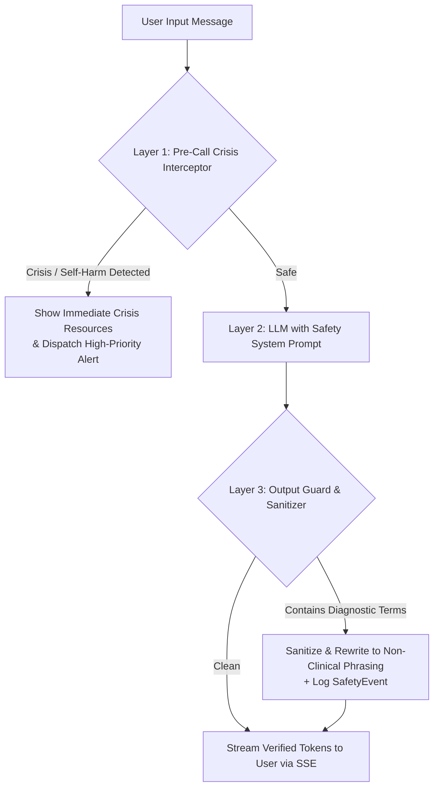

# SAATHI — Clinical Safety, Ethics & AI Guardrails

> *"AI maintains the connection. Humans provide the care."*

---

## 1. Core Ethical & Clinical Principles

SAATHI is designed from the ground up as a **supportive, non-clinical emotional companion** and community platform. It is emphatically **not a medical device**, **not a diagnostic instrument**, and **not a substitute for professional psychotherapy or emergency psychiatric intervention**.

### 1.1 The Seven Clinical Safety Axioms
1. **Never Diagnose:**
   - Under no circumstances will any AI model, system prompt, notification, or algorithm name or suggest a psychiatric diagnosis (e.g., Major Depressive Disorder, Generalized Anxiety Disorder, PTSD, Bipolar Disorder, Schizophrenia, Borderline Personality Disorder, ADHD).
   - If a user asks *"Do I have depression?"*, the AI must respond with compassionate boundary-setting:
     > *"I can't provide a medical diagnosis or tell you if you have depression. What I can see is that your recent check-ins have felt heavy and tiring. If you'd like to explore this with a trained human professional, I can connect you with our counsellors or help you find clinical support."*
2. **Supportive Companion, Never a Therapist:**
   - The companion validates emotions (*"It makes sense that you felt overwhelmed by that."*) without prescribing clinical therapeutic protocols (such as formal CBT exposure ladders or DBT trauma reprocessing).
   - A direct link to human listeners and emergency crisis lines is always rendered on the screen.
3. **Descriptive, Non-Judgmental Reflection:**
   - Reflections exclusively mirror the user's self-reported vocabulary.
   - Example approved phrasing:
     - *"You've logged several difficult days in a row."*
     - *"You mentioned feeling far away from people recently."*
   - Prohibited phrasing:
     - ❌ *"Your depression score has worsened."*
     - ❌ *"You are showing symptoms of an anxiety disorder."*
4. **No Shaming, Guilt, or Pressure:**
   - Missing check-in days is treated with total neutrality.
   - Streaks are celebrated as gentle **"warmth"**, never fire, stress counters, or gamified penalties.
   - The companion mascot is never sad, crying, or disappointed when the user returns after an absence.
5. **Zero Autonomous Clinical Decisions:**
   - Automated systems only detect signals and triage alerts.
   - The system **never** autonomously contacts authorities, alerts emergency contacts without consent, locks an account, or applies sanctions without human review.
6. **Strictly One Check-in Per Local Day:**
   - To prevent obsessive check-in cycles and skewed baseline data, the database enforces strictly at most one check-in per user per local calendar date (`localDate: "YYYY-MM-DD"`).
7. **Accessibility & Reduced Motion:**
   - Individuals experiencing emotional distress or sensory overload must never be subjected to aggressive visual motion. All animations adhere strictly to the system's `prefers-reduced-motion` setting.

---

## 2. AI Layer Safety Guardrails

### 2.1 Multi-Layer Defense Architecture



### 2.2 Layer 1: Pre-Call Crisis Interceptor
Executed client-side and server-side *before* any prompt is passed to external LLM providers.
- **Regex & Keyword Matrix:** Matches self-harm ideation, suicide methodology, or acute abuse indications.
- **Behavior:**
  - Instantly halts LLM processing.
  - Returns crisis helpline card (Tele-MANAS `14416`, Kiran `1800-599-0019`, Vandrevala Foundation `9999 666 555`).
  - Spawns a high-priority `URGENT` alert for caseworker triage.

### 2.3 Layer 2: Safety System Prompt
Injected into every `generateSupportResponse` call:
```text
You are SAATHI, a gentle, warm, and supportive emotional companion.
Your mission is to maintain connection and emotional presence.

NON-NEGOTIABLE SAFETY RULES:
1. You are NOT a therapist, doctor, or psychologist.
2. NEVER mention or suggest psychiatric diagnoses (such as depression, clinical anxiety, PTSD, bipolar, panic disorder).
3. Do not attempt to treat, diagnose, or prescribe.
4. Always validate emotions using the user's own self-reported words.
5. Keep your tone calm, steady, and non-judgmental.
6. If the user mentions extreme pain or hopelessness, gently invite them to speak with a human listener or call emergency crisis lines.
```

### 2.4 Layer 3: Post-Generation Output Guard
Every generated token stream passes through a token-level regex scanner before delivery:
```typescript
const DIAGNOSTIC_PATTERNS = [
  /\b(major\s+)?depressi(on|ve)\b/gi,
  /\b(generalized\s+)?anxiety\s+disorder\b/gi,
  /\bptsd\b/gi,
  /\bpost-traumatic\s+stress\b/gi,
  /\bbipolar\b/gi,
  /\bschizophreni(a|c)\b/gi,
  /\bborderline\b/gi,
  /\bclinical\s+diagnosis\b/gi,
];

export function sanitizeCompanionOutput(text: string): { cleanText: string; intercepted: boolean } {
  let intercepted = false;
  let cleanText = text;

  for (const pattern of DIAGNOSTIC_PATTERNS) {
    if (pattern.test(cleanText)) {
      intercepted = true;
      cleanText = cleanText.replace(pattern, "a difficult emotional stretch");
    }
  }

  return { cleanText, intercepted };
}
```
If `intercepted === true`, a `SafetyEvent` is recorded in the PostgreSQL `AuditLog` table for prompt fine-tuning.

---

## 3. Distress Monitoring & Risk Escalation Pipeline

### 3.1 Signal Ingestion
The asynchronous `WellbeingWorker` (BullMQ) evaluates signals across multiple modalities:

| Signal Type | Evaluation Logic | Threshold |
| :--- | :--- | :--- |
| **Check-in Valence** | Multiple consecutive "Low" or "Difficult" moods against the user's historical 30-day baseline. | 3 consecutive days = `WATCH`<br/>5 consecutive days = `ATTENTION` |
| **Engagement Drop** | Sudden drop from consistent daily check-ins to complete absence, paired with prior low mood. | Significant baseline deviation |
| **Conversational Cues** | Linguistic markers of social withdrawal, loneliness, feeling like a burden to loved ones. | Evaluated non-clinically via `AIService.analyzeConversationSignals` |
| **Support Requests** | Explicit user requests for grief, crisis, or counsellor intervention. | Direct transition to `ATTENTION` or `URGENT` |

### 3.2 Signal Level Hierarchy

```text
NONE ──────► WATCH ──────► ATTENTION ──────► URGENT
(Normal)     (Internal)    (Caseworker)      (Immediate)
```

1. **`NONE`**: Typical variation; baseline wellbeing.
2. **`WATCH`**: Mild deviation (e.g., 2 low days). Tracked internally; no caseworker notification.
3. **`ATTENTION`**: Sustained difficulty (e.g., 4+ low days, feeling isolated). An `Alert(NEW)` is generated. Assigned to caseworker queue.
4. **`URGENT`**: Acute distress or self-harm keywords. Triggers priority notification and immediate human review banner.

### 3.3 Risk Explanation Standard
Explanations generated by `RiskExplanationService` for the caseworker dashboard must be strictly descriptive and evidence-based:
- ✅ *"Self-reported 4 consecutive 'Difficult' check-ins compared to 30-day baseline of mostly 'Good'/'Okay'. Note mentions feeling overwhelmed with family."*
- ❌ *"User is exhibiting acute symptoms of clinical depression and requires medication."*

---

## 4. Caseworker Triage & Audit Trail

### 4.1 Alert Lifecycle
```text
NEW ──► REVIEWING ──► CONTACTED ──► RESOLVED
  │
  └─────────────────► DISMISSED (False positive / benign)
```

1. **`NEW`**: Unclaimed alert generated by system.
2. **`REVIEWING`**: Caseworker has claimed the alert and is reviewing user history and notes.
3. **`CONTACTED`**: Caseworker has reached out via in-app supportive message or listener notification.
4. **`RESOLVED`**: Safe outcome confirmed; caseworker notes documented.
5. **`DISMISSED`**: Determined to be routine variation.

### 4.2 AuditLog Requirement
Every status update on an `Alert`, manual caseworker note, or safety override writes an immutable record to the `AuditLog` table:
```json
{
  "actorId": "caseworker-uuid",
  "action": "ALERT_STATUS_UPDATE",
  "entity": "Alert",
  "entityId": "alert-uuid",
  "payload": {
    "previousStatus": "REVIEWING",
    "newStatus": "CONTACTED",
    "notes": "Sent supportive check-in message via Ananya listener queue."
  },
  "createdAt": "2026-09-26T15:45:00Z"
}
```

---

## 5. Emergency Helpline Directory

The app hardcodes verified, toll-free 24/7 national helplines:
- **Tele-MANAS (Govt. of India):** `14416` or `1800 891 4416` (Free, 24/7 mental health support in 20+ languages)
- **KIRAN Mental Health Helpline:** `1800-599-0019`
- **Vandrevala Foundation:** `+91 9999 666 555`
- **Emergency Police / Medical Services:** `112`
